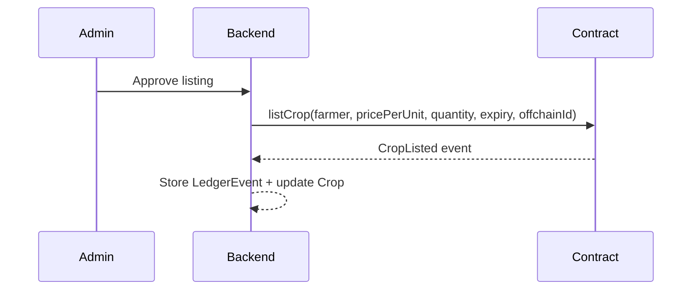
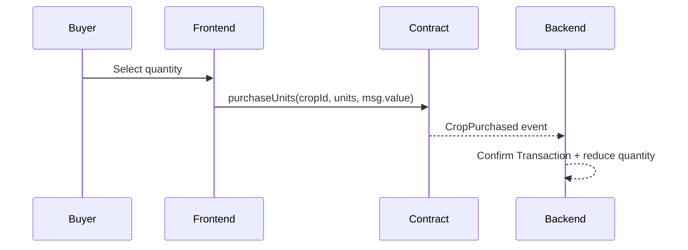
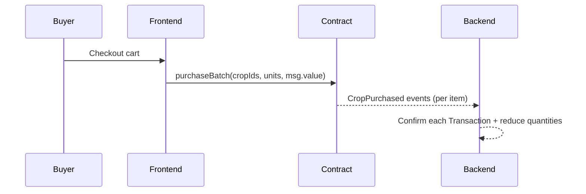
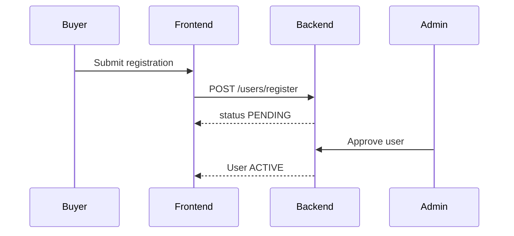
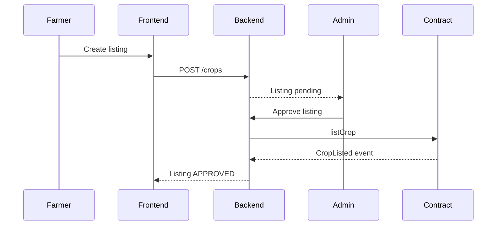
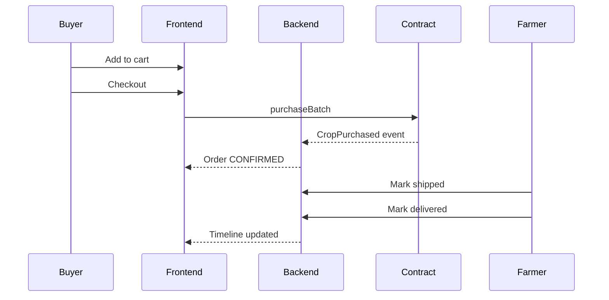

<div align="center">
  <h1>Blockchain-Based Agricultural Marketplace (Ganache)</h1>
  <p>A full-stack, role-based agricultural marketplace with admin-governed onboarding, off-chain metadata in MongoDB, and on-chain settlement on a local Ganache network.</p>
  <p>
    
    
    
    
  </p>
  <p>
    <a href="#overview">Overview</a> ·
    <a href="#architecture">Architecture</a> ·
    <a href="#local-setup">Local setup</a> ·
    <a href="#blockchain-integration-detailed">Blockchain integration</a> ·
    <a href="#api-reference">API reference</a>
  </p>
</div>

---

## Quick Links

[Overview](#overview) · [Architecture](#architecture) · [Roles and permissions](#roles-and-permissions) · [End-to-end flow](#end-to-end-flow-short-version) · [Tech stack](#tech-stack) · [Repository layout](#repository-layout) · [Prerequisites](#prerequisites) · [Core features](#core-features) · [Screenshots](#screenshots) · [Local setup](#local-setup) · [Scripts](#scripts) · [Environment variables](#environment-variables) · [Smart contract summary](#smart-contract-summary) · [Blockchain integration (detailed)](#blockchain-integration-detailed) · [Event logs and decoding](#event-logs-and-decoding-deep-dive) · [Sequence diagrams](#sequence-diagrams) · [UI walkthroughs](#ui-walkthroughs) · [Data model](#data-model) · [API reference](#api-reference) · [Troubleshooting](#troubleshooting) · [Development notes](#development-notes) · [License](#license)

## Table of Contents

- Overview
- Architecture
- Roles and permissions
- End-to-end flow
- Tech stack
- Repository layout
- Prerequisites
- Core features
- Screenshots
- Local setup
- Scripts
- Environment variables
- Smart contract summary
- Blockchain integration (detailed)
- Event logs and decoding (deep dive)
- Sequence diagrams
- UI walkthroughs
- Data model
- API reference
- Troubleshooting
- Development notes
- License

---

## Overview

This project implements a trust-first agricultural marketplace with:
- Admin approval for users and listings
- On-chain pricing and settlement in ETH
- Off-chain metadata and analytics in MongoDB
- End-to-end ledger transparency via contract events

## Architecture

| Layer | Tech | Responsibility |
| --- | --- | --- |
| Frontend | Next.js, React, Tailwind, ethers | UI, wallets, checkout, dashboards |
| Backend | Node.js, Express, MongoDB | Auth, approvals, metadata, analytics, uploads |
| Blockchain | Solidity, Hardhat, Ganache | Listings, purchases, immutable ledger |

## Roles and Permissions

| Role | Key actions |
| --- | --- |
| Admin | Approve users and listings, pause contract, blacklist wallets, view reports |
| Farmer | Create listings, upload assets, manage fulfillment |
| Buyer | Purchase approved crops, manage addresses, track orders |

## End-to-End Flow (Short Version)

1. Deploy contract to Ganache.
2. Start backend and frontend.
3. Admin approves farmers and buyers.
4. Farmer creates listing (off-chain).
5. Admin approves listing and publishes on-chain.
6. Buyer purchases via MetaMask (on-chain).
7. Backend syncs events, updates ledger and order status.

## Tech Stack

| Area | Tools |
| --- | --- |
| Frontend | Next.js 16, React 19, Tailwind CSS, ethers v6 |
| Backend | Node.js, Express, MongoDB, Mongoose, JWT, ethers v6 |
| Blockchain | Solidity 0.8.24, Hardhat, Ganache |

## Repository Layout

- `contracts/` Solidity contract, Hardhat config, and deploy script
- `backend/` Express API, MongoDB models, blockchain listener
- `frontend/` Next.js UI
- `frontend-ref/` Design reference only

## Prerequisites

- Node.js 18+ recommended
- Ganache (GUI or CLI)
- MetaMask browser extension
- MongoDB (Atlas or local)

## Core Features

| Feature | Notes |
| --- | --- |
| Marketplace | Filter by category and unit, INR + ETH pricing, add to cart, single-farmer batch checkout |
| Unit Scaling | Supports kg, g, ml, mg, stored in base units on-chain |
| Admin Approvals | Users and listings require approval before activation |
| Orders | Payment status: PENDING/CONFIRMED/FAILED, fulfillment status: PENDING/SHIPPED/DELIVERED |
| Ledger | On-chain events stored for listing and purchase history |
| Uploads | Crop images and compliance certificates (image/PDF, max 10 MB) |


## Local Setup

### 1) Start Ganache

RPC URL: `http://127.0.0.1:7545`
Chain ID: `1337`

### 2) Deploy the contract

```bash
cd /Users/syed.ahamed/skillup/Blockchain-Based-Agricultural-Marketplace/contracts
npm install
npm run deploy:ganache
```

### 3) Configure backend

Create `/Users/syed.ahamed/skillup/Blockchain-Based-Agricultural-Marketplace/backend/.env`:

```env
PORT=8000
MONGODB_URI=your_mongodb_uri
JWT_SECRET=replace-with-strong-secret
ADMIN_USERNAME=admin
ADMIN_PASSWORD=strong-password
ADMIN_WALLET=0xYOUR_ADMIN_ADDRESS
ADMIN_PRIVATE_KEY=0xYOUR_ADMIN_PRIVATE_KEY
GANACHE_RPC_URL=http://127.0.0.1:7545
CONTRACT_ADDRESS=0xYOUR_DEPLOYED_ADDRESS
CONTRACT_ABI_PATH=../contracts/deployments/ganache.json
CORS_ORIGIN=http://localhost:3000
EXPIRY_CHECK_INTERVAL_MS=3600000
ETH_INR_RATE=200000
ETH_RATE_CACHE_MS=60000
TX_RECONCILE_INTERVAL_MS=5000
TX_SYNC_ENABLED=true
TX_SYNC_FROM_BLOCK=0
TX_SYNC_LOOKBACK_BLOCKS=50000
FULFILLMENT_CHECK_INTERVAL_MS=3600000
FULFILLMENT_AUTO_SHIP_HOURS=6
FULFILLMENT_AUTO_DELIVER_HOURS=48
```

### 4) Start backend

```bash
cd /Users/syed.ahamed/skillup/Blockchain-Based-Agricultural-Marketplace/backend
npm install
npm run dev
```

### 5) Configure frontend

Create `/Users/syed.ahamed/skillup/Blockchain-Based-Agricultural-Marketplace/frontend/.env.local`:

```env
NEXT_PUBLIC_API_URL=http://localhost:8000
```

### 6) Start frontend

```bash
cd /Users/syed.ahamed/skillup/Blockchain-Based-Agricultural-Marketplace/frontend
npm install
npm run dev
```

### 7) MetaMask setup

Network
- Name: Ganache
- RPC: `http://127.0.0.1:7545`
- Chain ID: `1337`
- Currency: `ETH`

Accounts
- Import a funded Ganache account into MetaMask
- Use it as the Buyer wallet for purchases

---

## Scripts

| Area | Command | Description |
| --- | --- | --- |
| Contracts | `npm run compile` | Compile Solidity |
| Contracts | `npm run deploy:ganache` | Deploy to Ganache |
| Backend | `npm run dev` | Start API with nodemon |
| Backend | `npm run start` | Start API |
| Frontend | `npm run dev` | Start Next.js |
| Frontend | `npm run build` | Build frontend |

<details>
<summary><strong>Environment Variables</strong></summary>

### Backend

| Variable | Purpose |
| --- | --- |
| `PORT` | API port |
| `MONGODB_URI` | MongoDB connection |
| `JWT_SECRET` | JWT signing secret |
| `ADMIN_USERNAME` | Admin login user |
| `ADMIN_PASSWORD` | Admin login password |
| `ADMIN_WALLET` | Admin wallet address |
| `ADMIN_PRIVATE_KEY` | Admin private key for on-chain listings |
| `GANACHE_RPC_URL` | Ganache JSON-RPC URL |
| `CONTRACT_ADDRESS` | Deployed contract address |
| `CONTRACT_ABI_PATH` | ABI file path |
| `CONTRACT_ABI_JSON` | Optional ABI JSON string |
| `CORS_ORIGIN` | Frontend origin |
| `EXPIRY_CHECK_INTERVAL_MS` | Crop expiry check interval |
| `ETH_INR_RATE` | Fallback ETH/INR rate |
| `ETH_RATE_CACHE_MS` | Exchange rate cache TTL |
| `TX_RECONCILE_INTERVAL_MS` | Pending tx check interval |
| `TX_SYNC_ENABLED` | Enable event backfill |
| `TX_SYNC_FROM_BLOCK` | Start block for sync |
| `TX_SYNC_LOOKBACK_BLOCKS` | Lookback if no start block |
| `FULFILLMENT_CHECK_INTERVAL_MS` | Fulfillment check interval |
| `FULFILLMENT_AUTO_SHIP_HOURS` | Auto-ship threshold |
| `FULFILLMENT_AUTO_DELIVER_HOURS` | Auto-deliver threshold |

### Frontend

| Variable | Purpose |
| --- | --- |
| `NEXT_PUBLIC_API_URL` | API base URL |

### Contracts

| Variable | Purpose |
| --- | --- |
| `GANACHE_RPC_URL` | Network URL for Hardhat |

</details>

---

## Smart Contract Summary

Contract: `AgriChain`

Key Functions
- `listCrop(farmer, pricePerUnit, quantity, expiry, offchainId)`
- `purchaseCrop(cropId)`
- `purchaseUnits(cropId, units)`
- `purchaseBatch(cropIds, units)`

Events
- `CropListed`
- `CropPurchased`
- `ContractPaused`
- `ContractUnpaused`
- `WalletBlacklisted`

Security Rules
- Prevent double sale (`isSold`)
- Prevent underpayment (`msg.value == price`)
- Prevent expired sales (`expiry > block.timestamp`)
- Admin-only operations (`onlyOwner`)
- Reentrancy protection (`nonReentrant`)

---

## Blockchain Integration (Detailed)

### On-Chain Data Model

Each crop listing is stored on-chain with only the fields required for pricing and settlement. Off-chain metadata is stored in MongoDB.

On-chain `Crop` fields:
- `id`: on-chain crop ID (uint256)
- `farmer`: farmer wallet address
- `pricePerUnit`: price per base unit (wei)
- `quantity`: quantity in base units (uint256)
- `expiry`: UNIX timestamp
- `isSold`: boolean (true when quantity reaches 0)
- `buyer`: last buyer wallet (for reference)
- `offchainId`: MongoDB crop ID string

Off-chain fields live in MongoDB and include:
- Crop name, category, storage type, description
- Images and compliance certificate URLs
- Human-friendly quantity (e.g., `10 kg`) and unit scale

### Unit Scaling (Why Base Units Exist)

To support partial buying, quantities are stored on-chain in the smallest base unit. Examples:
- If unit is `kg`, base unit is `g`, scale = 1000
- If unit is `ml`, base unit is `ml`, scale = 1

The backend converts:
- Display quantity (e.g., `10 kg`) -> base units (`10000 g`)
- Price per display unit -> price per base unit (wei)

This makes `purchaseUnits(cropId, units)` safe for fractional user quantities while keeping integer values on-chain.

### Listing Flow (Off-chain -> On-chain)

1. Farmer submits listing via frontend.
2. Backend saves crop metadata in MongoDB with `status = PENDING`.
3. Admin approves listing.
4. Backend calls `listCrop(...)` on the contract using the admin wallet.
5. Contract emits `CropListed` event.
6. Backend listener updates MongoDB:
- `contractCropId`
- `txHash`
- `status = APPROVED`
- Backfills ETH pricing from on-chain `pricePerUnit`

### Purchase Flow (On-chain -> Off-chain)

1. Buyer adds items to cart and checks out.
2. Frontend calls `purchaseBatch(cropIds, units)` with `msg.value = totalWei`.
3. Contract validates:
- Crop exists, not expired, not sold
- Units requested are available
- `msg.value` equals expected total
4. Contract emits `CropPurchased`.
5. Backend listener records the transaction in MongoDB:
- `status = CONFIRMED`
- `txHash`, `blockNumber`, `timestamp`
- Buyer wallet, farmer wallet, units, ETH value
6. Backend reduces crop quantity in MongoDB.
7. If quantity reaches zero, crop status becomes `SOLD`.

### Single-Farmer Batch Purchase

`purchaseBatch` requires all crops in the batch to belong to the same farmer. This guarantees:
- Single ETH transfer to the farmer
- One atomic transaction for multiple items

The frontend enforces this by blocking checkout if cart items belong to multiple farmers.

### Event Listener + Reconciliation

The backend runs two systems for blockchain sync:

Event listener:
- Subscribes to `CropListed` and `CropPurchased`
- Updates MongoDB immediately on event receipt

Reconciliation loop:
- Periodically checks all `PENDING` transactions
- Uses `eth_getTransactionReceipt` to confirm or mark `FAILED`

Startup event sync:
- Scans historical blocks and replays events
- Useful if backend was down or Ganache was restarted

Config keys:
- `TX_RECONCILE_INTERVAL_MS`
- `TX_SYNC_ENABLED`
- `TX_SYNC_FROM_BLOCK`
- `TX_SYNC_LOOKBACK_BLOCKS`

### Why Ganache Shows 0.00 ETH

Ganache UI rounds value to two decimals. If a transaction sends less than 0.01 ETH, it will display `0.00` even though it has a real value.

Use `eth_getTransactionByHash` to confirm exact `value` in wei.

### Admin Controls (On-chain)

Admin-only functions:
- `pause()` and `unpause()` stop all purchases
- `setBlacklist(wallet, status)` blocks malicious wallets

These functions are protected by `onlyOwner`, and the owner is the admin wallet used during deployment.

### Price Source of Truth

On-chain price is authoritative for settlement:
- UI displays INR and ETH
- ETH is always used for smart contract payment
- INR is derived from ETH using a live rate

If ETH price is missing in MongoDB, the backend backfills it from on-chain events.

---

## Event Logs and Decoding (Deep Dive)

The contract emits two critical events:

`CropListed(uint256 cropId, address farmer, uint256 pricePerUnit, uint256 quantity, uint256 expiry, string offchainId)`

`CropPurchased(uint256 cropId, address buyer, uint256 units, uint256 value)`

How the backend decodes:
- The listener receives the event with `event.args` from ethers.
- For reconciliation, the backend parses raw logs using the ABI:
- `contract.interface.parseLog(log)`
- Decoded fields are mapped into MongoDB:
- `LedgerEvent` records an immutable audit row
- `Transaction` is updated to `CONFIRMED`

Example mapping:
- `pricePerUnit` (wei) -> `pricePerBaseUnitEth` (ETH string)
- `value` (wei) -> `valueEth` (ETH string)
- `units` (base units) -> `units` (integer in DB)

Raw receipt inspection (useful for debugging):

```bash
curl -s -X POST http://127.0.0.1:7545 \
  -H "Content-Type: application/json" \
  --data '{"jsonrpc":"2.0","method":"eth_getTransactionReceipt","params":["0xTX_HASH"],"id":1}'
```

### Function-Level Blockchain Flow

#### listCrop (Admin only)



#### purchaseUnits (Buyer)



#### purchaseBatch (Buyer, same farmer only)



### Gas Usage Notes

Gas depends on crop count, batch size, and Ganache configuration. Typical ranges on local Ganache:
- `listCrop`: ~80k to 150k gas
- `purchaseCrop` / `purchaseUnits`: ~60k to 120k gas
- `purchaseBatch`: base + ~30k to 50k per item

If you see large gas costs in MetaMask:
- Reduce batch size
- Ensure Ganache gas price is reasonable
- Use smaller data payloads (avoid overly long `offchainId`)

### Settlement and Value Precision

The contract uses wei (integer) for all values:
- `pricePerUnit` is stored in wei
- `value` in `CropPurchased` is wei
- Frontend converts to ETH for display

Precision rules:
- UI converts INR -> ETH using live rate
- ETH to wei uses `ethers.parseEther`
- On-chain only accepts integer wei values

---

## Sequence Diagrams

### User Registration and Approval



### Listing Approval and On-Chain Publish



### Purchase and Fulfillment



## UI Walkthroughs

### Admin

1. Sign in using admin username and password.
2. Open Users to approve farmers and buyers.
3. Open Listings to review new crops and approve on-chain.
4. Open Transactions to monitor payments and ledger entries.
5. Use Emergency to pause or blacklist wallets if needed.

### Farmer

1. Register as FARMER and wait for admin approval.
2. Connect MetaMask and sign in.
3. Create a new listing with unit, pricing, and expiry.
4. Upload crop images and compliance certificate.
5. After admin approval, monitor orders in Farmer Orders.
6. Mark fulfillment status as SHIPPED then DELIVERED.

### Buyer

1. Register as BUYER and wait for admin approval.
2. Connect MetaMask and sign in.
3. Browse marketplace and filter by category or unit.
4. Add listings to cart and choose quantity.
5. Add or select shipping address and checkout.
6. Track payment and delivery timeline in My Orders.

---

## Data Model

### User

Key fields:
- `name`, `contact`, `location`
- `role`: ADMIN, FARMER, BUYER
- `walletAddress`
- `status`: PENDING, ACTIVE, REJECTED, SUSPENDED
- `shippingAddresses` (buyer only)

### Crop

Key fields:
- `name`, `category`, `description`, `storageType`
- `quantity`, `quantityUnit`, `quantityBaseValue`, `unitScale`
- `pricePerUnitEth`, `pricePerUnitInr`, `pricePerBaseUnitEth`
- `status`: PENDING, APPROVED, REJECTED, SOLD, EXPIRED
- `contractCropId`, `txHash`

### Transaction

Key fields:
- `txHash`, `buyerWallet`, `farmerWallet`
- `valueEth`, `units`
- `status`: PENDING, CONFIRMED, FAILED
- `fulfillmentStatus`: PENDING, SHIPPED, DELIVERED
- `shippingAddress`

### LedgerEvent

Key fields:
- `type`: CropListed or CropPurchased
- `txHash`, `blockNumber`, `logIndex`
- `valueEth`, `units`, `timestamp`

---

## API Reference

Auth
- `GET /auth/nonce?wallet=0x...`
- `POST /auth/verify`
- `POST /auth/admin`

Users
- `POST /users/register`
- `GET /users/me`
- `GET /users/addresses`
- `POST /users/addresses`
- `PATCH /users/addresses/:id`
- `PATCH /users/addresses/:id/default`
- `DELETE /users/addresses/:id`
- `GET /users/admin`
- `POST /users/admin/:id/approve`
- `POST /users/admin/:id/reject`
- `POST /users/admin/:id/suspend`

Crops
- `GET /crops`
- `POST /crops`
- `GET /crops/mine`
- `GET /crops/admin/all`
- `POST /crops/admin/:id/approve`
- `POST /crops/admin/:id/reject`

Transactions
- `GET /transactions`
- `GET /transactions/admin`
- `POST /transactions/intent`
- `PATCH /transactions/:id/fulfillment`

Other
- `GET /ledger`
- `GET /rates/eth-inr`
- `GET /stats/marketplace`
- `GET /stats/admin`
- `GET /stats/farmer`
- `GET /stats/buyer`
- `POST /uploads`

---

## Troubleshooting

| Issue | Fix |
| --- | --- |
| Orders stuck at PENDING | Check contract address, restart backend, verify event sync |
| Ganache shows 0.00 | Value is small, check wei via JSON-RPC |
| Insufficient funds | Import a funded Ganache account into MetaMask |
| ABI not found | Ensure `CONTRACT_ABI_PATH` points to deployments file |
| Orders empty | Confirm correct wallet is signed in |

## Development Notes

- Cart purchases call `purchaseBatch` and require items from the same farmer.
- Admin approval publishes listings to chain using the admin private key.
- Off-chain crop metadata is stored in MongoDB; only price and quantity are on-chain.
- Crop quantities are stored in base units for precise partial buying.
