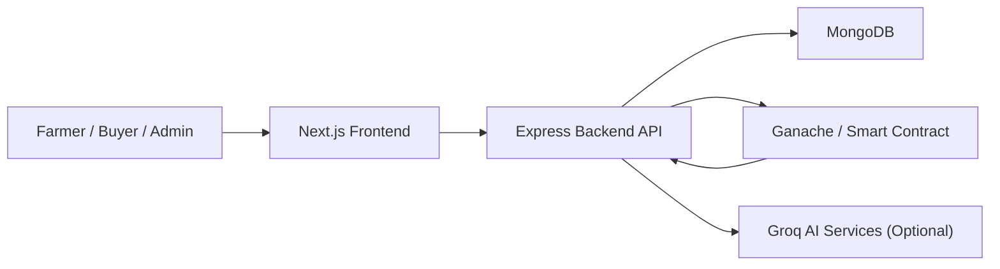
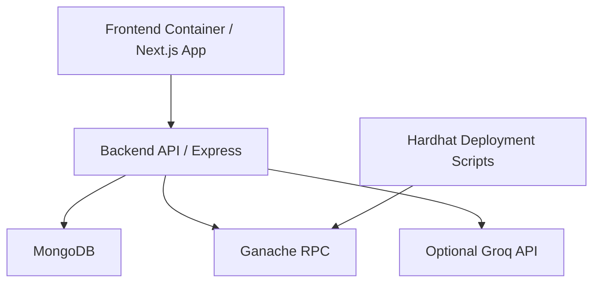

# Overall System Design

## 1. Objective

The Blockchain-Based Agricultural Marketplace is designed to replace informal middleman functions with a transparent digital platform for:

- farmer onboarding and listing management
- buyer discovery and purchase
- admin-driven trust and compliance control
- blockchain-based settlement and ledger visibility
- predictive waste reduction
- digital quality, trust, and support services

## 2. High-Level Architecture

## 3. Layered Design

| Layer | Technology | Responsibility |
| --- | --- | --- |
| Presentation Layer | Next.js, React, Tailwind | Dashboards, marketplace UI, admin control center, farmer support screens |
| Application Layer | Node.js, Express | Business rules, approvals, analytics, trust scoring, resources, uploads |
| Data Layer | MongoDB, Mongoose | Users, crops, transactions, ledger events, location and freshness metadata |
| Blockchain Layer | Solidity, Hardhat, Ganache | Immutable listing/purchase records, settlement, owner fee routing |
| Intelligence Layer | Rule-based analytics, optional Groq | Waste prediction, recommendations, crop/resource guidance |

## 4. Core Actors

| Actor | Responsibility |
| --- | --- |
| Farmer | Registers, creates listings, sets quality grade, manages stock, fulfills orders |
| Buyer | Browses listings, checks grade/trust, buys produce, gives ratings, requests returns |
| Admin | Approves users and listings, reviews quality/compliance, monitors reports and trust |

## 5. Main Modules

### 5.1 User and Access Module

- role-based users: `ADMIN`, `FARMER`, `BUYER`
- wallet-based identity and admin login
- pincode and geo-location support
- shipping address management for buyers

Primary implementation:
- `/backend/src/models/User.js`
- `/backend/src/routes/auth.js`
- `/backend/src/routes/users.js`

### 5.2 Marketplace and Listing Module

- farmer creates crop listings
- listing stores quantity, unit scale, pricing, freshness period, expiry, storage type, images, and certificate
- admin approves listing before it is published on-chain
- buyer sees verified listings with quality grade and trust signals

Primary implementation:
- `/backend/src/models/Crop.js`
- `/backend/src/routes/crops.js`
- `/frontend/src/app/dashboard/farmer/new/page.tsx`
- `/frontend/src/app/marketplace/page.tsx`
- `/frontend/src/app/admin/listings/page.tsx`

### 5.3 Blockchain Settlement and Ledger Module

- approved listing is mirrored to `AgriChain.sol`
- buyer purchases via MetaMask
- blockchain listener syncs purchase/listing events back to MongoDB
- ledger events provide traceability for listing, purchase, return, and delivery actions

Primary implementation:
- `/contracts/contracts/AgriChain.sol`
- `/backend/src/services/blockchain.js`
- `/backend/src/models/LedgerEvent.js`
- `/backend/src/routes/ledger.js`

### 5.4 Order, Delivery, and Return Module

- purchase intent recorded in MongoDB
- fulfillment states: `PENDING`, `SHIPPED`, `DELIVERED`
- delivery tracking: pickup, transit, SLA monitoring
- buyer return request and farmer/admin return review

Primary implementation:
- `/backend/src/models/Transaction.js`
- `/backend/src/routes/transactions.js`
- `/backend/src/services/fulfillment.js`
- `/frontend/src/app/dashboard/buyer/orders/page.tsx`
- `/frontend/src/app/dashboard/farmer/orders/page.tsx`

### 5.5 Waste Intelligence Module

- historical demand forecasting using average plus regression
- production vs demand gap detection
- freshness and expiry tracking
- waste risk classification: `LOW`, `MEDIUM`, `HIGH`
- alert engine for expiry and surplus stock
- waste datasets for admin monitoring

Primary implementation:
- `/backend/src/services/analytics.js`
- `/backend/src/services/expiry.js`
- `/backend/src/routes/stats.js`
- `/frontend/src/app/dashboard/farmer/expiry/page.tsx`
- `/frontend/src/app/admin/waste-data/page.tsx`

### 5.6 Quality and Trust Module

- farmer grading with `A / B` quality option
- buyer feedback and order rating
- reliability score derived from rating and return behavior
- return workflow as a digital replacement for middleman dispute handling
- visible trust layer in marketplace and reports

Primary implementation:
- `/backend/src/models/Crop.js`
- `/backend/src/models/Transaction.js`
- `/backend/src/routes/transactions.js`
- `/backend/src/routes/stats.js`
- `/frontend/src/app/marketplace/page.tsx`
- `/frontend/src/app/admin/reports/page.tsx`

### 5.7 Farmer Resource and Support Module

- crop-category storage guidelines
- recommended equipment and tools
- external purchase links
- card-based catalog with image, description, and recommendation reason

Primary implementation:
- `/backend/src/routes/resources.js`
- `/frontend/src/app/dashboard/farmer/resources/page.tsx`
- `/frontend/public/resources/`

## 6. Data Design

| Entity | Purpose | Key Fields |
| --- | --- | --- |
| `User` | Role-based actor profile | `role`, `walletAddress`, `status`, `pincode`, `geoLocation`, `shippingAddresses`, `dvuBalance` |
| `Crop` | Farmer listing metadata | `name`, `category`, `qualityGrade`, `quantityBaseValue`, `priceEth`, `expiryDate`, `storageType`, `farmerWallet`, `status` |
| `Transaction` | Purchase and trust lifecycle | `cropId`, `farmerWallet`, `buyerWallet`, `status`, `fulfillmentStatus`, `returnStatus`, `rating`, `shippingAddress`, `slaBreached` |
| `LedgerEvent` | Audit trail | `type`, `txHash`, `cropId`, `actor`, `valueEth`, `timestamp` |

## 7. Key Runtime Flows

### 7.1 User Registration and Approval

1. Farmer or buyer registers with wallet and profile data.
2. Backend stores user as `PENDING`.
3. Admin approves the user.
4. Approved user can access role-based dashboard functions.

### 7.2 Listing Lifecycle

1. Farmer creates a listing with quantity, grade, freshness, storage, and assets.
2. Listing is stored off-chain in MongoDB as `PENDING`.
3. Admin reviews compliance and quality.
4. Backend publishes approved listing to smart contract.
5. Listing becomes visible in marketplace as verified inventory.

### 7.3 Purchase and Settlement

1. Buyer selects listing and shipping address.
2. Frontend calls contract purchase using MetaMask.
3. Backend records transaction intent.
4. Blockchain listener confirms transaction and updates MongoDB.
5. Farmer fulfills delivery and buyer tracks order.

### 7.4 Trust and Return Flow

1. Delivered order becomes eligible for rating.
2. Buyer submits rating and optional feedback.
3. Buyer may request return if dissatisfied.
4. Farmer or admin reviews return request.
5. Reliability score is recalculated from ratings and returns.

### 7.5 Waste Intelligence Flow

1. Confirmed orders form historical demand dataset.
2. Active crop listings form supply dataset.
3. Freshness logic computes `ACTIVE`, `NEAR_EXPIRY`, or `EXPIRED`.
4. Forecast engine predicts demand by category.
5. Alert engine generates surplus and expiry alerts.
6. Farmer and admin dashboards show mitigation signals.

## 8. Quality Attributes

| Attribute | Design Choice |
| --- | --- |
| Transparency | On-chain listing and purchase events plus ledger event storage |
| Trust | Admin approval, quality grading, ratings, reliability score, return workflow |
| Traceability | MongoDB transaction records linked with blockchain hashes |
| Waste Reduction | Forecasting, expiry tracking, spoilage indicators, alert engine |
| Extensibility | Modular route/service structure and role-specific frontend pages |
| Hyperlocal Efficiency | Pincode and geo-location filters for nearby matching |

## 9. API View

| Area | Example Endpoints |
| --- | --- |
| Auth | `/auth/nonce`, `/auth/verify`, `/auth/admin` |
| Users | `/users/register`, `/users/me`, `/users/farmers/near` |
| Crops | `/crops`, `/crops/mine`, `/crops/admin/all` |
| Transactions | `/transactions`, `/transactions/intent`, `/transactions/:id/rating`, `/transactions/:id/return/request` |
| Stats | `/stats/admin`, `/stats/farmer`, `/stats/farmer/waste`, `/stats/marketplace/waste`, `/stats/waste/datasets` |
| Resources | `/resources/farmer` |

## 10. Deployment View

## 11. Summary

The system combines:

- a role-based marketplace
- admin-governed trust and compliance
- blockchain settlement and auditability
- predictive waste management
- digital quality and support services

This architecture is suitable for demonstrating how a traditional agricultural middleman can be replaced by a transparent, data-driven, and trust-aware digital platform.
